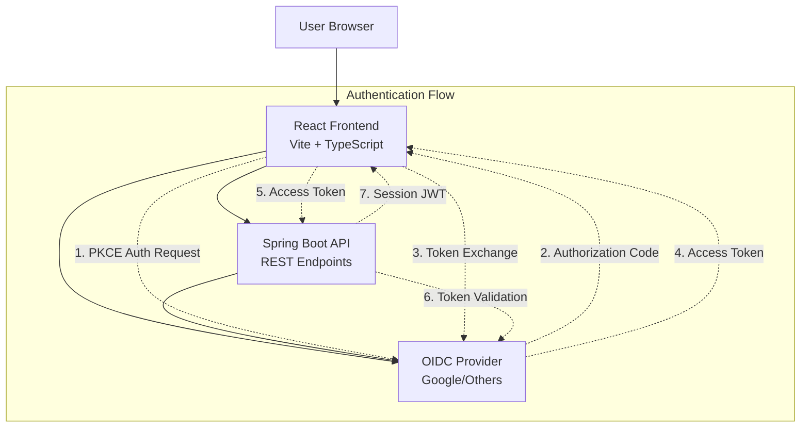
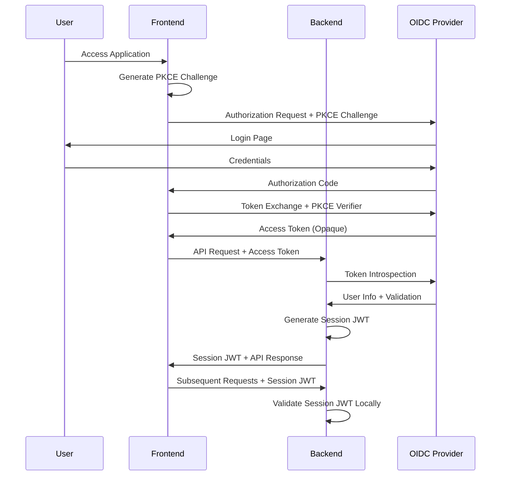

# Design Document

## Overview

This system consists of a Spring Boot REST API backend and a React TypeScript frontend that work together to provide a secure, authenticated web application. The architecture implements OIDC authentication with PKCE flow for the frontend, opaque token validation, and session management using JWTs issued by the backend.

### Key Technologies
- **Backend**: Spring Boot 3.x, Spring Security 6.x, Spring Web, JWT libraries
- **Frontend**: React 18, TypeScript, Vite, OIDC client library
- **Authentication**: OIDC with PKCE, Google as primary provider
- **Session Management**: Custom JWT tokens with timeout policies

## Architecture

### High-Level Architecture



### Authentication Flow Sequence



## Components and Interfaces

### Backend Components

#### 1. Security Configuration
- **Purpose**: Configure Spring Security for OIDC and JWT validation
- **Key Classes**:
  - `SecurityConfig`: Main security configuration
  - `OidcConfig`: OIDC provider configuration
  - `JwtConfig`: JWT signing and validation configuration

#### 2. Authentication Components
- **OidcTokenValidator**: Validates opaque access tokens with OIDC provider
- **SessionJwtService**: Creates and validates session JWTs
- **AuthenticationController**: Handles token exchange endpoint

#### 3. Session Management
- **SessionService**: Manages session lifecycle and timeouts
- **SessionRepository**: Stores active session metadata (optional for stateless)

#### 4. REST Controllers
- **AuthController**: Authentication endpoints
- **ApiController**: Protected business logic endpoints
- **HealthController**: Health check endpoints

#### 5. Security Filters
- **OidcTokenFilter**: Processes initial OIDC access tokens
- **SessionJwtFilter**: Processes session JWT tokens
- **SecurityContextFilter**: Sets up security context

### Frontend Components

#### 1. Authentication Components
- **AuthProvider**: React context for authentication state
- **OidcClient**: OIDC PKCE flow implementation
- **TokenManager**: Manages token storage and refresh

#### 2. API Integration
- **ApiClient**: HTTP client with automatic token injection
- **AuthInterceptor**: Adds authentication headers to requests

#### 3. UI Components
- **LoginButton**: Initiates OIDC flow
- **LogoutButton**: Clears session and redirects
- **ProtectedRoute**: Route guard for authenticated pages
- **HelloWorld**: Main application component

## Data Models

### Backend Models

#### User Information
```java
public class UserInfo {
    private String userId;
    private String email;
    private String name;
    private List<String> roles;
    private Instant lastActivity;
    private Instant sessionCreated;
}
```

#### Session JWT Claims
```java
public class SessionClaims {
    private String sub; // User ID
    private String email;
    private String name;
    private List<String> roles;
    private Long iat; // Issued at
    private Long exp; // Expires at
    private Long lastActivity;
    private Long sessionStart;
}
```

#### API Response Models
```java
public class AuthResponse {
    private String sessionToken;
    private UserInfo user;
    private Long expiresIn;
}

public class ErrorResponse {
    private String error;
    private String message;
    private String timestamp;
}
```

### Frontend Models

#### Authentication State
```typescript
interface AuthState {
  isAuthenticated: boolean;
  user: UserInfo | null;
  sessionToken: string | null;
  accessToken: string | null;
  loading: boolean;
  error: string | null;
}

interface UserInfo {
  userId: string;
  email: string;
  name: string;
  roles: string[];
}
```

#### API Client Configuration
```typescript
interface ApiConfig {
  baseUrl: string;
  timeout: number;
  retryAttempts: number;
}
```

## Error Handling

### Backend Error Handling

#### Global Exception Handler
- **ValidationException**: HTTP 400 with field-specific errors
- **AuthenticationException**: HTTP 401 with authentication failure details
- **AuthorizationException**: HTTP 403 with access denied message
- **ResourceNotFoundException**: HTTP 404 with resource details
- **InternalServerException**: HTTP 500 with generic error message

#### Security Error Handling
- **Invalid OIDC Token**: HTTP 401 with token validation error
- **Expired Session JWT**: HTTP 401 with session expired message
- **Session Timeout**: HTTP 401 with inactivity timeout message
- **Maximum Session Duration**: HTTP 401 with session duration exceeded

### Frontend Error Handling

#### Authentication Errors
- **OIDC Flow Errors**: Redirect to error page with retry option
- **Token Refresh Failures**: Automatic re-authentication flow
- **Session Expiry**: Clear local state and redirect to login

#### API Errors
- **Network Errors**: Retry mechanism with exponential backoff
- **Authentication Errors**: Trigger re-authentication flow
- **Validation Errors**: Display field-specific error messages

## Testing Strategy

### Backend Testing

#### Unit Tests
- **Security Configuration**: Test OIDC and JWT configuration
- **Token Validation**: Test OIDC token introspection
- **Session Management**: Test JWT creation and validation
- **Timeout Logic**: Test inactivity and maximum duration timeouts
- **Error Handling**: Test all error scenarios

#### Integration Tests
- **Authentication Flow**: End-to-end authentication testing
- **API Endpoints**: Test protected endpoint access
- **Security Filters**: Test filter chain behavior
- **OIDC Integration**: Mock OIDC provider interactions

#### Security Tests
- **Token Validation**: Test invalid and expired tokens
- **Session Security**: Test session hijacking prevention
- **CORS Configuration**: Test cross-origin request handling

### Frontend Testing

#### Unit Tests
- **Authentication Components**: Test OIDC flow logic
- **Token Management**: Test token storage and refresh
- **API Client**: Test request/response handling
- **Error Handling**: Test error state management

#### Integration Tests
- **Authentication Flow**: Test complete OIDC PKCE flow
- **API Integration**: Test authenticated API calls
- **Session Management**: Test session timeout handling
- **Route Protection**: Test protected route behavior

#### End-to-End Tests
- **Login Flow**: Complete authentication workflow
- **Session Timeout**: Test inactivity and maximum duration
- **Logout Flow**: Test session cleanup
- **Error Scenarios**: Test various failure modes

### Configuration Management

#### Backend Configuration
```yaml
# application.yml
spring:
  security:
    oauth2:
      resourceserver:
        jwt:
          issuer-uri: ${OIDC_ISSUER_URI}
        opaque-token:
          introspection-uri: ${OIDC_INTROSPECTION_URI}
          client-id: ${OIDC_CLIENT_ID}
          client-secret: ${OIDC_CLIENT_SECRET}

app:
  jwt:
    secret: ${JWT_SECRET}
    expiration: 1200 # 20 minutes
    max-session-duration: 86400 # 24 hours
  cors:
    allowed-origins: ${FRONTEND_URL}
```

#### Frontend Configuration
```typescript
// config.ts
export const config = {
  api: {
    baseUrl: process.env.VITE_API_BASE_URL || 'http://localhost:8080',
  },
  oidc: {
    authority: process.env.VITE_OIDC_AUTHORITY,
    clientId: process.env.VITE_OIDC_CLIENT_ID,
    redirectUri: `${window.location.origin}/callback`,
    scope: 'openid profile email',
    responseType: 'code',
    usePkce: true,
  },
};
```